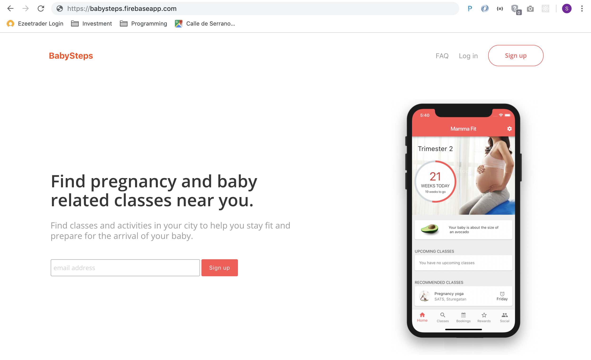

# babysteps

An app for mums and dads who are expecting their first baby, or who have just had a baby, to help them find pregnancy and parenting related classes in their area. 




## Getting Started

These instructions will get you a copy of the project up and running on your local machine for development and testing purposes. See deployment for notes on how to deploy the project on a live system.

### Prerequisites

You'll need to have Nodejs installed.


### Installing

Clone the repository to your computer.

Then go to the folder and run:

```
npm run start
```

This will compile all the css files from the sass files and then fire up lite-server.

## Running the tests

[TODO] add tests


## Built With

* [Nodejs](https://nodejs.org/en/) - Of course!
* [React](https://reactjs.org/) - To help bind all components together
* [Sass](https://sass-lang.com/) - To make CSS readable
* [Material UI](https://material-ui.com) - To help with out of the box design elements

## Versioning

V0.1 - Beta (still under active development)

## Authors

* **Sam Heyman** - [samheyman.com](https://samheyman.com)

## License

This project is licensed under the MIT License - see the [LICENSE.md](LICENSE.md) file for details

## Acknowledgments

* This project was built as part of the Coursera Specialization [Full-Stack Web Development with React Specialization](https://www.coursera.org/specializations/full-stack-react)
